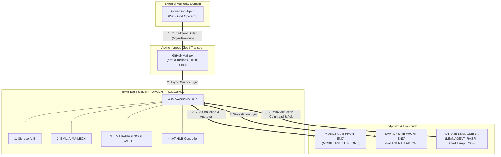

# Continuum-Meta Truth Root & Home-Base System Topology

> **Status:** Standard Reference Blueprint & System Topology (v1.2)  
> **Source:** Whiteboard Specification by J Diesel (August 17, 2026)  
> **Repository:** [`https://github.com/jdieselny/agent-in-body`](https://github.com/jdieselny/agent-in-body)  

---

## 1. Executive Overview

This specification formalizes the **5-Agent Truth Root Topology** for the Continuum Nomadic Agent-in-Body (A:iB) ecosystem. 

By decoupling external order dispatch from local execution through an asynchronous **GitHub Mailbox**, the architecture enforces strict security boundaries while providing seamless multi-device continuity.

---

## 2. Architecture & Data Flow Diagram

---

## 3. The 5 Continuum-Meta Agent Roles

| Agent Role | Hardware Container | Compute Tier | Primary Function |
| :--- | :--- | :--- | :--- |
| **1. `FATAGENT_LAPTOP`** | Laptop / Workstation | `FAT_AGENT` | Code synthesis, Antigravity IDE, multi-file refactoring frontend |
| **2. `HQAGENT_HOMEBASE`** | Desktop / Rackmount Server | `FAT_AGENT` / Hub | **Central Backend Engine:** Runs Git A:iB, Mailbox Router, EMILIA Gate & IoT Hub |
| **3. `MOBILEAGENT_PHONE`** | Smartphone / Tablet | `LEAN_AGENT` | PWA Voice Gateway, Passkey 2FA approval UI, on-the-go interaction |
| **4. `LEANAGENT_RASPI`** | Raspberry Pi / AiPi Board | `LEAN_AGENT` | Hardware actuator, Smart Lamp relay pin control, 700W load shedding |
| **5. `GOVERNING_AGENT`** | External Cloud Server / ISO | Authority | Dispatches signed grid curtailment orders to GitHub Mailbox out-of-band |

---

## 4. End-to-End Execution Sequence

1. **Governing Agent Dispatches Order**: The `GOVERNING_AGENT` posts a signed grid curtailment payload (`700W Load Shed`) to the **GitHub Mailbox** out-of-band.
2. **Home-Base Intake (`HQAGENT_HOMEBASE`)**: The Home-Base backend fetches the envelope via `emilia-mailbox`, validates the sender domain via DNS-AID, and routes it to `EMILIA-PROTOCOL (GATE)`.
3. **Multi-Endpoint Notification**: Home-Base dings the `LEANAGENT_RASPI` / `MOBILEAGENT_PHONE`: *"New grid curtailment order arrived from ISO."*
4. **Human Passkey 2FA Approval**: The operator approves via `MOBILEAGENT_PHONE` or `FATAGENT_LAPTOP` using a WebAuthn / FIDO2 Passkey assertion.
5. **Attested Actuation (`LEANAGENT_RASPI`)**: Home-Base's **IoT Hub** instructs `LEANAGENT_RASPI` to toggle the relay pin (Micro-Datacenter set to `CURTAILED / 0W`), generating a signed Proof-of-Curtailment receipt.

---

© 2026 J Diesel NY, LLC · Continuum Protocol Specification
