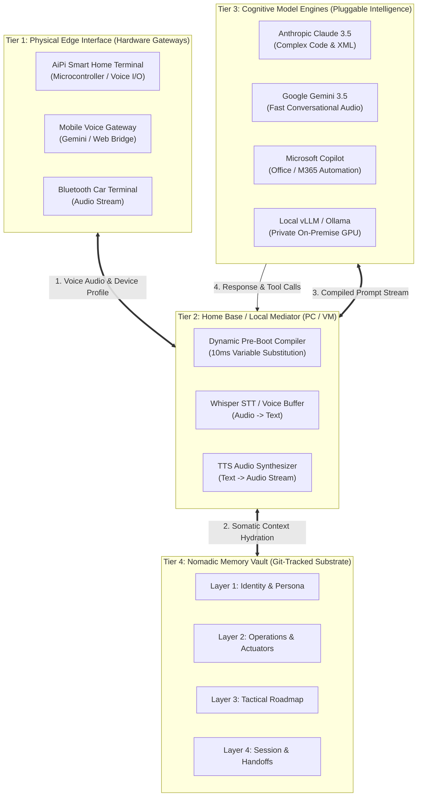
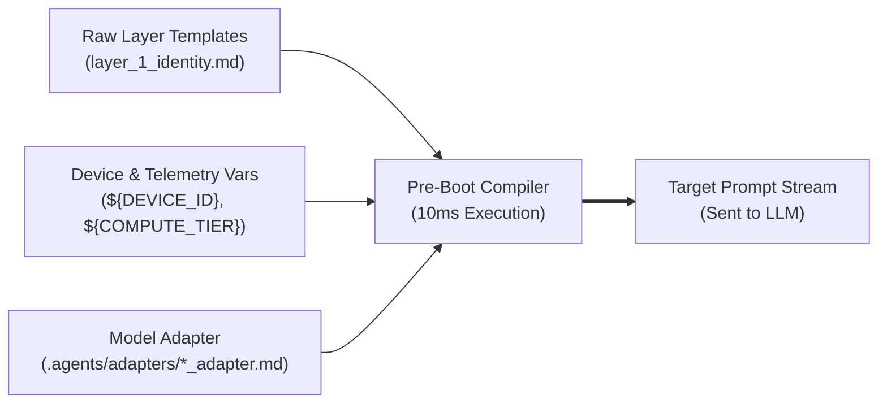
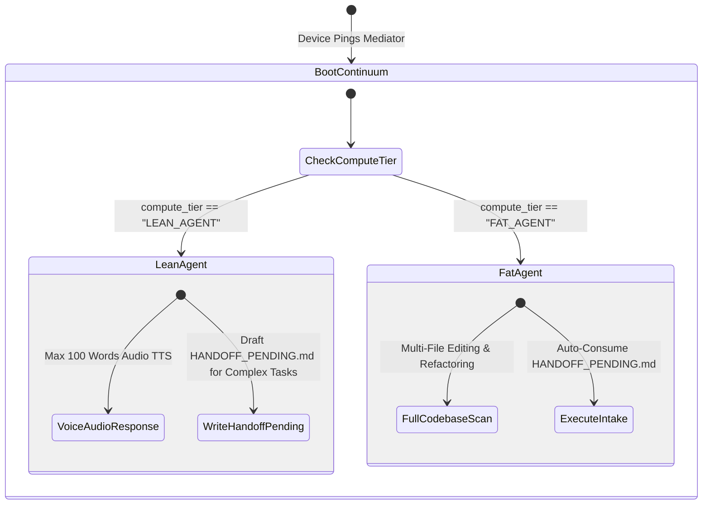
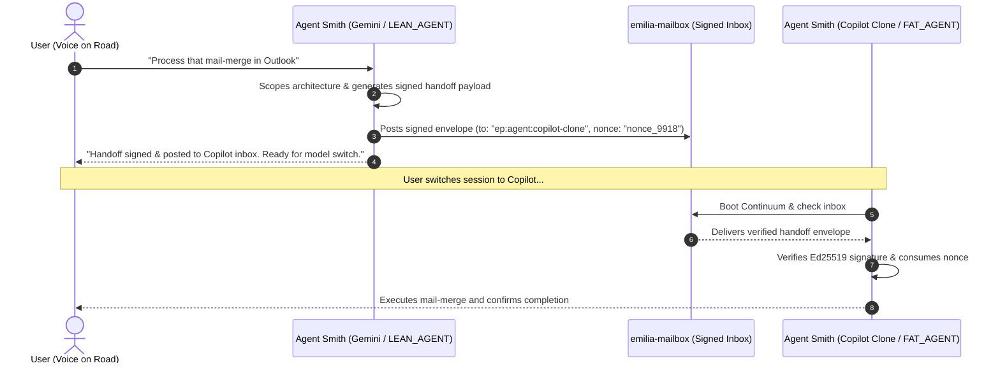

# COSA Architecture & Continuum Boot Protocol Specification

> **Public Architectural Specification & Marketecture Blueprint**  
> **Repository:** [`https://github.com/jdieselny/agent-in-body`](https://github.com/jdieselny/agent-in-body) / [`https://github.com/jdieselny/jdieselny-continuum`](https://github.com/jdieselny/jdieselny-continuum)  
> **Status:** Live Specification (COSA v1.2)  

---

## 1. Executive Summary & Marketecture Overview

The **Cognitive Open System Architecture (COSA)** and **Continuum Boot Protocol** define an open, provider-agnostic framework for building **Nomadic AI Agents**. 

Unlike legacy AI architectures that lock agent memory, state, and identity inside proprietary cloud vendors or monolithic vector databases, COSA decouples the AI system into four independent, interchangeable tiers:



### Key Engineering Principles
* **Nomadic Identity:** An agent (e.g., *Agent Smith*) retains a continuous, unified identity across all hardware terminals, workstations, and cloud VMs.
* **Provider Independence:** Switch between Claude, Gemini, GPT, Copilot, or local open-weights LLMs without losing context, state, or identity.
* **Device-Aware Tiering:** Automatically scale cognitive payloads and UI outputs based on whether the active container is a lightweight edge node (`LEAN_AGENT`) or a full workstation (`FAT_AGENT`).
* **Cryptographic Verification:** Inter-agent communication and multi-device handoffs use signed, content-addressed envelopes backed by `emilia-mailbox`.

---

## 2. The 4-Layer Context Matrix

Continuum structures agent context into four distinct layers. Each layer uses dynamic Markdown templates with embedded `${VARIABLE}` tokens compiled at boot:

| Layer | Type | Storage | Contents & Dynamic Substitutions | Operational Scope |
| :--- | :--- | :--- | :--- | :--- |
| **Layer 1: Identity** | Core | Git-Tracked | Dynamic Persona, `${DEVICE_ID}`, `${COMPUTE_TIER}`, `${ACTIVE_MODEL}` | Universal |
| **Layer 2: Operations** | Functional | Git-Tracked | Tool Definitions, Local Actuator Bindings (`${CONNECTED_PERIPHERALS}`) | Device-Aware |
| **Layer 3: Roadmap** | Tactical | Git-Tracked | Active Milestones, Project Backlog, Verification Targets | Project-Wide |
| **Layer 4: Session** | Volatile | Ephemeral / Git | Turn State, Ritual Logs, Pending Handoff Envelopes | Session-Bound |

---

## 3. Dynamic Pre-Boot Compiler & Model Adapters (`.agents/adapters/`)

Before any prompt is dispatched to a background LLM, the local Home Base Mediator runs a **10-millisecond Pre-Boot Compiler**. 

The compiler dynamically hydrates variable placeholders inside the Layer files and appends the exact **Model Adapter** corresponding to the selected AI engine:



### Model Adapter Architecture

Different LLM architectures have distinct behavioral strengths and prompt sensitivities. The `.agents/adapters/` directory fine-tunes operational rules per model:

```
.agents/adapters/
├── claude_adapter.md       # Enforces XML tag parsing (<thinking>) & precise code diffs
├── gemini_adapter.md       # Optimizes for fast audio flow & structured JSON tool calls
├── copilot_adapter.md      # Binds M365 Graph API, Word, & Outlook automation rules
└── local_vllm_adapter.md   # Tight context budgeting & raw Markdown stop tokens
```

---

## 4. Hardware-Aware Edge vs. Workstation Tiering

COSA classifies all connected hardware containers into distinct **Compute Tiers**:



### Tier Comparison Matrix

| Feature | `LEAN_AGENT` (Edge Node / AiPi / Mobile) | `FAT_AGENT` (Workstation / Antigravity IDE) |
| :--- | :--- | :--- |
| **Primary Container** | AiPi Board, Mobile Voice Bridge, Car Terminal | Workstation Laptop, Cloud VM, Antigravity IDE |
| **Interaction Mode** | Conversational Audio (TTS/STT), Hardware Button | Text, Multi-File Code Editor, Terminal Shell |
| **Response Constraint** | Concise audio responses (under 100 words) | Full code diffs, architecture diagrams, build logs |
| **Complex Task Strategy** | Drafts structured `HANDOFF_PENDING.md` envelope | Consumes handoff, executes build/tests, updates state |

---

## 5. Cryptographic Handoff & Mailbox Seam (`emilia-mailbox`)

When an agent running on one device or model needs to delegate a task to a specialized clone on another device (e.g., a Gemini voice session delegating a mail-merge task to a Copilot clone), the handoff is serialized and signed via **`emilia-mailbox`**:



---

© 2026 COSA Protocol Community · Published under Apache-2.0
